::: questions
-   How do I determine if an omics data set is of good quality?
-   How do I identify samples that may have technical issues?
:::

::: objectives
-   Read in transcript and protein data and format it for analysis.
-   Transform and standardize data to perform principal component analysis (PCA).
-   Interpret a PCA plot to identify potential outlier samples.
:::

## \*-omics QC

Most \*-omics data is derived from raw measurements which are heavily processed 
to produce a matrix of measurements with [features](../learners/reference.md) 
(i.e. transcripts, proteins, metabolites, etc.) in rows and samples in columns. 
Each technology has its own set of best practices for quality control and 
normalization. In this lesson, we will be working with *processed* data, which 
has gone through these procedures.


``` r
suppressPackageStartupMessages(library(tidyverse)) 
suppressPackageStartupMessages(library(ggrepel))
suppressPackageStartupMessages(library(pcaMethods))
```

::: tab

### On your own computer


``` r
# Metadata file.
meta_file = 'data/motrpac_metadata.csv'

# RNA file directory.
rna_dir   = 'data/rna'

# RNA files.
rna_files = dir(path = rna_dir, full.names = TRUE)

# Protein file directory.
prot_dir  = 'data/protein'  

# Protein files.
prot_files = dir(path = prot_dir, full.names = TRUE) 
```


### On CAVATICA


``` r
# Base project directory.
base_dir  = '/sbgenomics/workspace'

# Data directory.
data_dir  = file.path(base_dir, 'data')

# Metadata directory.
meta_file = file.path(data_dir, 'motrpac_metadata.csv')  

# RNA file directory.
rna_dir   = file.path(data_dir, 'rna')  

# RNA files.
rna_files = dir(path = rna_dir, full.names = TRUE)

# Protein file directory.
prot_dir  = file.path(data_dir, 'protein')  

# Protein files.
prot_files = dir(path = prot_dir, full.names = TRUE) 
```


:::


### Sample Metadata

First, we will read in the sample metadata file. A 
[metadata](../learners/reference.md) file contains information about the data, 
for example, the sex, age, and type of sample. In this case, we will extract the 
sex and treatment groups for the rats.


``` r
meta = read_csv(meta_file, col_types = 'cccccc')
```

What are the dimensions of the metadata?


``` r
dim(meta)
```

``` output
[1] 6156    6
```

Next, we will look at the first few rows of the sample metadata.


``` r
head(meta)
```

``` output
# A tibble: 6 × 6
  pid      bid   viallabel   sex   age   grp     
  <chr>    <chr> <chr>       <chr> <chr> <chr>   
1 10023259 90217 90217013001 male  1     8wk_ctrl
2 10023259 90217 90217013104 male  1     8wk_ctrl
3 10023259 90217 90217013105 male  1     8wk_ctrl
4 10023259 90217 90217013106 male  1     8wk_ctrl
5 10023259 90217 90217013107 male  1     8wk_ctrl
6 10023259 90217 90217013108 male  1     8wk_ctrl
```

There are several columns with cryptic numbers in them. The `pid` column is a 
unique number for each rat. The `bid` column is unique numeric value for a batch 
of rats in a cohort. The `viallabel` column is a unique number for a sample 
vial. The sex, age, and grp columns contain other information about each rat.

How many rats do we have in each group?


``` r
meta |>
  select(pid, sex, age, grp) |>
  distinct() |>
  count(sex, age, grp) |>        
  pivot_wider(names_from = sex, values_from = n)
```

``` output
# A tibble: 5 × 4
  age   grp      female  male
  <chr> <chr>     <int> <int>
1 1     1wk          15    15
2 1     2wk          15    15
3 1     4wk          18    18
4 1     8wk_ctrl     12    12
5 1     8wk_trng     14    13
```

There are about 15 rats per treatment group. Also, it appears that we only have 
data for the 6 month old rats, so we will not use age as a factor in our 
analysis.

### Transcript Matrix

We have reformatted some of the MoTrPAC transcript files to make them easier to 
read in for this tutorial. We have converted them to numeric matrices and saved 
them in [\[RDS\]](https://www.rdocumentation.org/packages/base/versions/3.6.2/topics/readRDS%5D%5BRDS%5D)(https://www.rdocumentation.org/packages/base/versions/3.6.2/topics/readRDS) format. RDS is a binary, compressed format for storing R objects.


``` r
tissue = 'kidney'

i = str_detect(rna_files, tissue)
  
rna = readRDS(rna_files[i])
```

What are the dimensions of the RNA matrix?


``` r
dim(rna)
```

``` output
[1] 15981    50
```

The data has about 16,000 rows and 50 columns. Let's look at the top of the 
file.


``` r
rna[1:5,1:5]
```

``` output
                   90217015902 90218015902 90222015902 90223015902 90225015902
ENSRNOG00000000012    -1.25005    -1.33353    -0.98970    -0.66202     0.40944
ENSRNOG00000000017     2.73095     2.80670     3.06532     3.14039     2.71366
ENSRNOG00000000021     3.63803     3.85895     3.67937     3.66677     3.75723
ENSRNOG00000000024     2.77459     2.44771     2.61562     2.48395     2.91182
ENSRNOG00000000033     2.13625     2.76537     2.67416     2.78849     2.46297
```

From the top of the RNA file, you can see that genes are in rows. The rownames 
which look like `ENSRNOG00000000012` are Ensembl rat gene IDs. The columns 
contain the samples. This is a traditional omics data format which is transposed 
from the traditional statistics table format in which samples are in rows and observations are in columns.

::::::::::::::::: challenge
## Challenge 1: What kind of data is in the `rna` object?

Click on the `rna` data object in the Environment tab on the right side of your 
screen. Look at the numbers in the data matrix. Do we have RNASeq counts? Make a histogram of the data to look at it's distribution. Then make a boxplot of the 
RNA data. How do you think that the data has been transformed and processed?

::: solution
The data is *NOT* RNASeq counts because it does not contain integers. It has 
gone through some type of processing or normalization. Since all of the columns 
sum to about the same value and the data ranges between -3 and 16, it has 
probably been log-transformed and library-size adjusted.

``` r
hist(rna)
boxplot(rna)
```
:::
:::::::::::::::::

Next, let's check whether we have any missing data. We will do this by summing 
the number of elements in the data matrix that are NA.


``` r
sum(is.na(rna))
```

``` output
[1] 0
```

Since the sum of NA values is 0, we have no missing data.

Next, we will get the sample metadata for the cortex samples. We will filter the 
larger sample metadata file and align the sample IDs between the metadata and 
the transcript data.


``` r
meta_rna = meta[match(colnames(rna), meta$viallabel),]

all(colnames(rna) == meta_rna$viallabel)
```

``` output
[1] TRUE
```

Now that we have meaningful group identifiers for each sample, we will calculate 
the [principal components](../learners/reference.md) of the expression counts. R 
has several functions which calculate principal components, but we will use the `pcaMethods` package. There are many different methods to compute the principal components in the `pcaMethods` package. You can use the `listPcaMethods()` 
function to list all of them. Here, we will used the `svd` method, which uses 
[singular value decomposition](../learners/reference.md) to calculate the 
principal components. We will also standardize the columns to make the mean 
equal to zero and the standard deviation equal to one.


``` r
pca_rna = pcaMethods::pca(object = rna,
                          nPcs   = 10,
                          method = 'svd',
                          scale  = 'uv')
```

Let's look at the PCA summary.


``` r
summary(pca_rna)
```

``` output
svd calculated PCA
Importance of component(s):
                 PC1     PC2    PC3     PC4     PC5    PC6     PC7     PC8
R2            0.9738 0.00653 0.0020 0.00109 0.00066 0.0006 0.00056 0.00056
Cumulative R2 0.9738 0.98031 0.9823 0.98340 0.98406 0.9847 0.98522 0.98578
                  PC9   PC10
R2            0.00052 0.0005
Cumulative R2 0.98630 0.9868
```

From the summary of the PCA, we can see that PC1 accounts for the overwhelming 
majority of the variance. This is a large amount of variance for the first PC to 
explain and it may indicate something unusual about the data.

Let's get the principal components from the PCA object. This is stored in the 
`loadings` slot.


``` r
ldngs = data.frame(loadings(pca_rna)) |>
          rownames_to_column('viallabel') |>
          left_join(meta_rna, by = 'viallabel')
```

Then we will plot the first two principal components, colored and shaped by sex 
and experimental group.


``` r
ldngs |>
  ggplot(aes(PC1, PC2, color = sex, shape = grp)) +
  geom_point(size = 5) +
  labs(title = str_c('PCA of ', tissue, ' Expression'),
       x     = str_c('PC1 (', round(pca_rna@R2[1] * 100), '%)'),
       y     = str_c('PC2 (', round(pca_rna@R2[2] * 100), '%)')) +
  theme(text = element_text(size = 18))
```

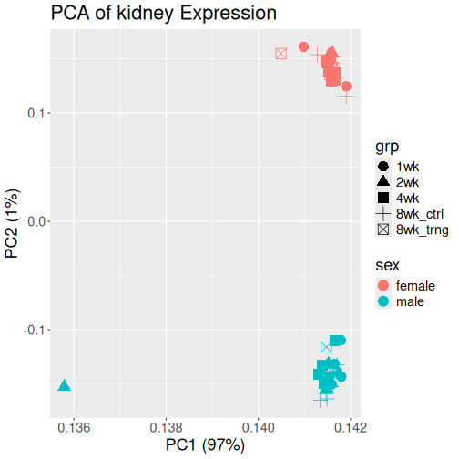

The plot above shows PC1 on the X-axis and PC2 on the Y-axis. Each point 
represents one rat's kidney expression value and is colored by sex and shaped by experimental group.
Note that PC1 accounts for 97% of the variance, which is high.

::: challenge
## Challenge 2: What do you think about this plot?

Look at the PCA plot. What differences do you see between the sex and treatment 
groups? Are there any odd points?

::: solution
The data separate by sex on the PC2 axis. At this resolution, there are not 
large differences between treatment groups. There is one point, a male in the 2 
week group, which is far from the other points on the PC1 axis.
:::
:::

What should we do about the outlier data point? Why might one sample be far from 
the others? Is it a real data point that should be left in the data set? Should 
we remove it? How can we start looking into whether this is a data point that we 
should ask the investigators about?

First, let's get the sample ID for the outlier sample.


``` r
outlier = ldngs |>
             filter(PC1 < 0.136)
```

Then, let's add the vial label to the plot.


``` r
ldngs |>
  ggplot(aes(PC1, PC2, color = sex, shape = grp)) +
  geom_point(size = 5) +
  geom_label_repel(data = outlier, aes(PC1, PC2, label = viallabel)) +
  labs(title = str_c('PCA of ', tissue, ' Expression'),
       x     = str_c('PC1 (', round(pca_rna@R2[1] * 100), '%)'),
       y     = str_c('PC2 (', round(pca_rna@R2[2] * 100), '%)')) +
  theme(text = element_text(size = 18))
```


Do we have any other data that we could use to figure out whether the kidney 
data is "good" or not? Perhaps the rat has kidney disease and really is quite 
different from the other rats. Or perhaps the rat has an infection. We can't 
remove this data point on our own, but we can gather evidence to present to the 
investigator to make a decision.

We have transcript data in other tissues and protein data in the same tissues. 
What if we look at the other data and see if the same rat is an outlier in other
data sets?

Let's gather all of the code together to read in the transcript data for one 
tissue, get the sample metadata, and make a PCA plot.


``` r
# Get the viallabel for the outlier sample so that we can plot it.
outlier_vial = outlier$viallabel[1]

# Get the index of the RNA file for the current tissue.
i = str_detect(rna_files, tissue)

# Get the tissue.
tissue = str_replace_all(basename(rna_files[i]), '_rna_log_norm_cpm\\.rds$', '')

# Read in the transcript data.
rna = readRDS(rna_files[i])

# Get the sample metadata.
meta_rna = meta[match(colnames(rna), meta$viallabel),]

# Perform PCA.
pca_rna = pcaMethods::pca(object = rna,
                          nPcs   = 10,
                          method = 'svd',
                          scale  = 'uv')

# Get the loadings from the PCA.
ldngs = data.frame(loadings(pca_rna)) |>
          rownames_to_column('viallabel') |>
          left_join(meta_rna, by = 'viallabel')

# Plot PC1 & PC2. 
p = ldngs |>
      ggplot(aes(PC1, PC2, color = sex, shape = grp)) +
      geom_point(size = 5) +
      geom_label_repel(data = outlier, aes(PC1, PC2, label = viallabel)) +
      labs(title = str_c('PCA of ', tissue, ' Expression'),
           x     = str_c('PC1 (', round(pca_rna@R2[1] * 100), '%)'),
           y     = str_c('PC2 (', round(pca_rna@R2[2] * 100), '%)')) +
      theme(text = element_text(size = 18))

print(p)
```

::: instructor
Form the students into groups. Have some of them read in all of the transcript 
data, make a PCA plot, and compare it with the kidney transcript data. Have 
other groups read in the proteomics data, make PCA plots and compare it with the 
kidney data. The proteomics data will have missing data, so the students will 
need to change the PCA method to `nipals`.
:::

# Transcript PCA Plots


``` r
# Get the pid for the outlier sample so that we can plot it.
outlier_pid = outlier$pid[1]

for(i in seq_along(rna_files)) {
  
  # Get the tissue.
  tissue = str_replace_all(basename(rna_files[i]), '_rna_log_norm_cpm\\.rds$', '')

  # Read in the transcript data.
  rna = readRDS(rna_files[i])
  
  # Get the sample metadata.
  meta_rna = meta[match(colnames(rna), meta$viallabel),]

  # Perform PCA.
  pca_rna = pcaMethods::pca(object = rna,
                            nPcs   = 10,
                            method = 'svd',
                            scale  = 'uv')

  # Get the loadings.
  ldngs = data.frame(loadings(pca_rna)) |>
            rownames_to_column('viallabel') |>
            left_join(meta_rna, by = 'viallabel')

  # Get the outlier sample in this data set.
  outlier = ldngs |>
              filter(pid == outlier_pid)
  
  # Plot PC1 & PC2.
  p = ldngs |>
        ggplot(aes(PC1, PC2, color = sex, shape = grp)) +
        geom_point(size = 5) +
        geom_label_repel(data = outlier, aes(PC1, PC2, label = viallabel)) +
        labs(title = str_c('PCA of ', tissue, ' Expression'),
             x     = str_c('PC1 (', round(pca_rna@R2[1] * 100), '%)'),
             y     = str_c('PC2 (', round(pca_rna@R2[2] * 100), '%)')) +
        theme(text = element_text(size = 18))
  
  print(p)

} # for(i)
```

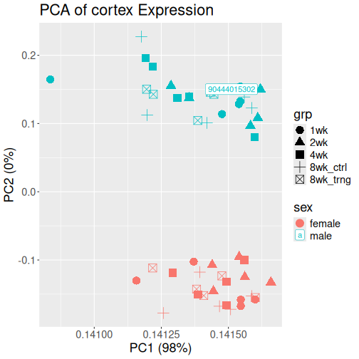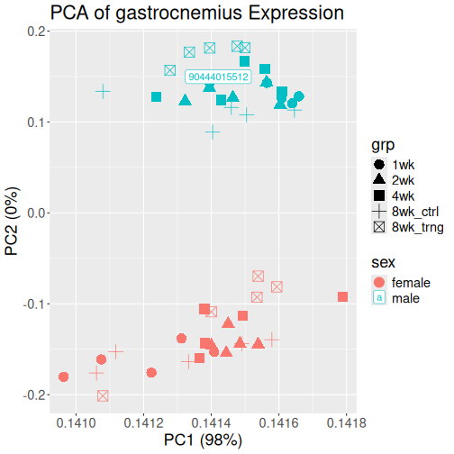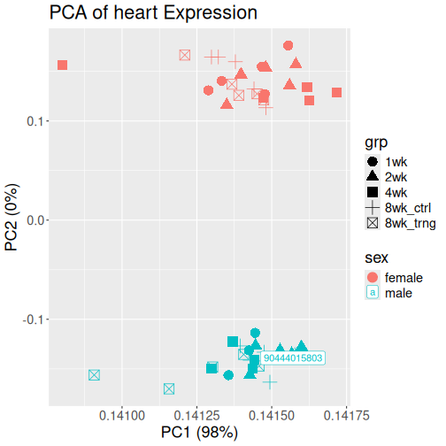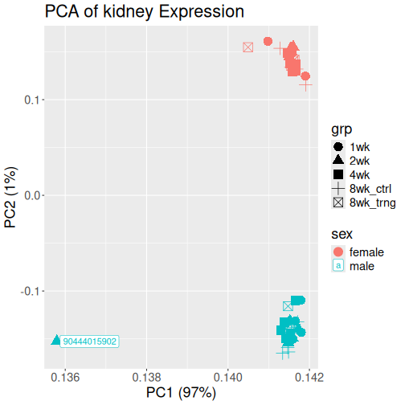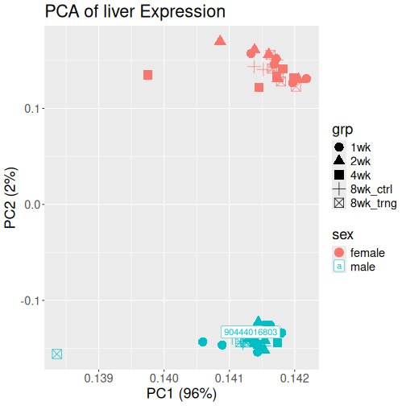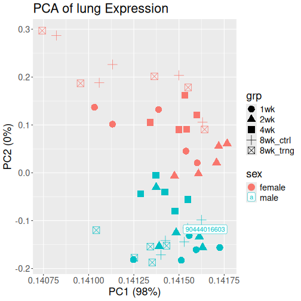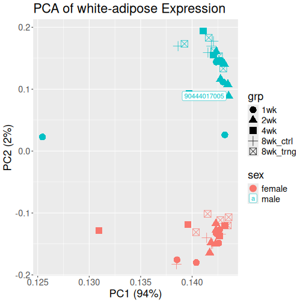

# Protein PCA Plots


``` r
# Get the pid for the outlier sample so that we can plot it.
outlier_pid = outlier$pid[1]

for(i in seq_along(prot_files)) {
  
  # Get the tissue.
  tissue = str_replace_all(basename(prot_files[i]), '_prot_norm_lr\\.rds$', '')

  # Read in the protein data.
  prot = readRDS(prot_files[i])
  
  # Get the sample metadata.
  meta_prot = meta[match(colnames(prot), meta$viallabel),]

  # Perform PCA.
  pca_prot = pcaMethods::pca(object = prot,
                             nPcs   = 10,
                             method = 'nipals',
                             scale  = 'uv')

  # Get the loadings.
  ldngs = data.frame(loadings(pca_prot)) |>
            rownames_to_column('viallabel') |>
            left_join(meta_prot, by = 'viallabel')

  # Get the outlier sample in this data set.
  outlier = ldngs |>
              filter(pid == outlier_pid)
  
  # Plot PC1 & PC2.
  p = ldngs |>
    ggplot(aes(PC1, PC2, color = sex, shape = grp)) +
    geom_point(size = 5) +
    geom_label_repel(data = outlier, aes(PC1, PC2, label = viallabel)) +
    labs(title = str_c(tissue, ' Protein'),
             x     = str_c('PC1 (', round(pca_rna@R2[1] * 100), '%)'),
             y     = str_c('PC2 (', round(pca_rna@R2[2] * 100), '%)')) +
        theme(text = element_text(size = 18))

  print(p)
  
} # for(i)
```

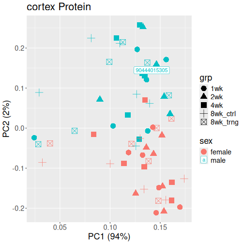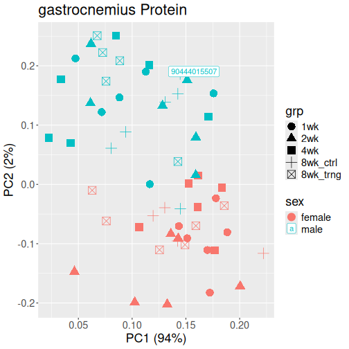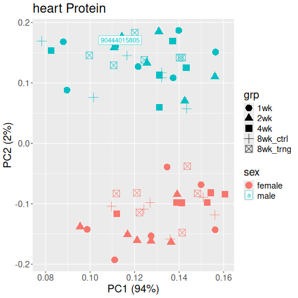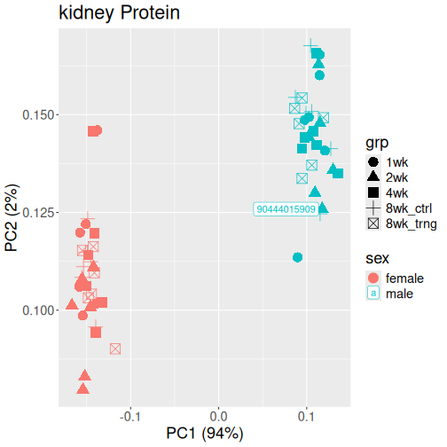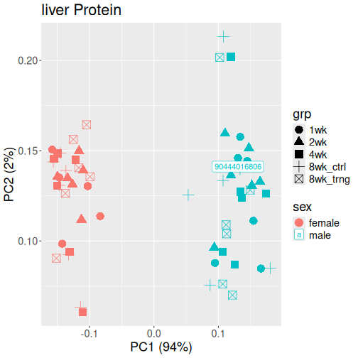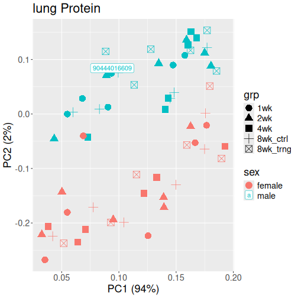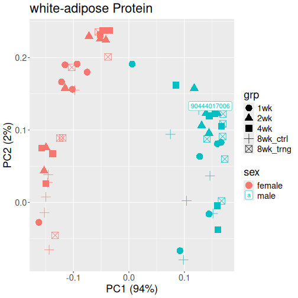

::: keypoints
-   Omics data are so large that they need to be summarized concisely.
-   Principal component analysis is a linear dimensionality reduction method which allows omics data to be visualized.
-   PCA plots can be quick and effective ways to identify trouble in omics data before proceeding with analysis.
:::
