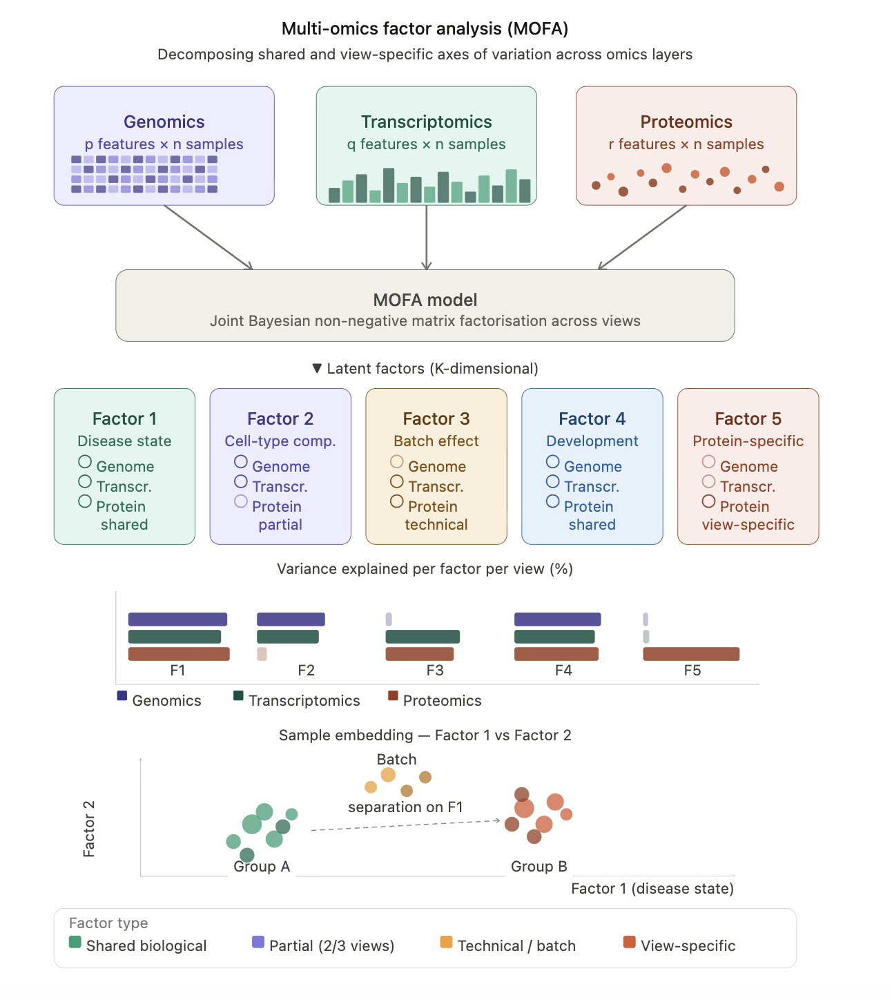

:::::::::::::::::::::::::::::::::::::: questions 

- How do you write a lesson using R Markdown and `{sandpaper}`?

::::::::::::::::::::::::::::::::::::::::::::::::

::::::::::::::::::::::::::::::::::::: objectives

- Explain how to use markdown with the new lesson template
- Demonstrate how to include pieces of code, figures, and nested challenge blocks

::::::::::::::::::::::::::::::::::::::::::::::::


``` error
Error in `readChar()`:
! cannot open the connection
```

``` error
Error in `readChar()`:
! cannot open the connection
```

``` error
Error in `readChar()`:
! cannot open the connection
```

``` error
Error in `readChar()`:
! cannot open the connection
```

``` error
Error in `readChar()`:
! cannot open the connection
```

``` error
Error in `readChar()`:
! cannot open the connection
```


# Background & Motivation

Multi-Omics Factor Analysis (MOFA) is an unsupervised statistical framework 
designed to integrate diverse biological datasets. Much like a 
Principal Component Analysis (PCA) for multiple matrices, MOFA decomposes 
complex data into a set of Factors that represent the underlying biological 
drivers.

Argelaguet, R., Velten, B., Arnol, D. *et al.* Multi‐Omics Factor Analysis—a framework for unsupervised integration of multi‐omics data sets. *Mol Syst Biol* **14**, MSB178124 (2018). <https://doi.org/10.15252/msb.20178124>

::: callout-note
## Key Concept: Why not just use PCA?

If we simply stack RNA and Protein data and run a standard PCA, the model treats 
every feature as having the same "source" of noise and variance. This 
is problematic for two reasons:

1.  **Unique Variance Structures**: RNA and Protein have different dynamic 
ranges and measurement noise. A PCA might prioritize the "noisiest" modality 
rather than the most biological one.
2.  **Concordance vs. Discordance**: PCA forces all data into a single set of 
components. It cannot easily distinguish between a biological signal that is 
synchronized (seen in both RNA and Protein) and one that is view-specific 
(e.g., a post-translational change that only appears in the Protein data).
3.  **Feature Space Imbalance**: In multi-omics, one view often has 
significantly more features than another (e.g., 20,000 transcripts vs. 10,000 
proteins). In a concatenated PCA, the view with more features exerts more 
"weight" on the model, potentially drowning out critical signals from the 
smaller dataset.

MOFA solves this by assigning each data type its own View. This allows the model 
to mathematically separate the "Global" variance (the story both views tell 
together) from the "Private" variance (the story unique to just the Protein or 
just the RNA).
:::

# MOFA: Modeling the "State" of the Tissue

We use MOFA to build a mathematical model of the tissue. This is an 
**iterative process** where our goal is to identify the 
**underlying biological programs** that coordinate individual molecular changes. 
Rather than viewing different omics data sets as separate lists, MOFA treats 
them as different reporters covering the same story.

Once the model is trained, we can determine which factors track with our primary 
**experimental question** and which represent other major sources of variation. 
In any high-dimensional data set, these factors will reflect a mix of 
**intrinsic biological traits**—such as sex, age, or cellular composition—and 
**technical influences** like batch effects. By capturing these independent 
patterns of variation, MOFA allows us to isolate the specific signal we are 
looking for from the broader landscape of biological and technical noise.



# Moving Beyond the Central Dogma with MOFA

::: callout-note
## Key Concept

If biology followed one linear path (i.e. the central dogma of DNA 
$\rightarrow$ RNA $\rightarrow$ Protein), we would only ever need to measure one 
outcome. Multi-omics is about more than finding where these data modalities 
agree; it is also about capturing where they differ to tell the full story of a 
tissue or cell.
:::

Integrating high-dimensional RNA and protein data can be challenging because 
they are not just copies of each other; they operate on different timescales and 
under different physical constraints. Examples of biological uncoupling include:

-   Temporal Lag: You see the RNA 'instruction', but the protein 'result' hasn't accumulated yet.

-   Translational buffering: A secondary signal is required to start translation.

-   Protein turnover: A protein is being degraded or used as fast as it is made.

MOFA addresses the gap between RNA 'instruction' and protein 'result' by 
identifying factors based on sample-wide covariation rather than gene-to-protein 
correlation. By analyzing the concordant (synchronized) and discordant 
(divergent) drivers within a factor, we can distinguish between the core genetic 
programs and the post-translational tuning that ultimately shapes physiology.

:::::::::::::::::::::::::::::::::::::: questions 

- What is multi-omics factor analysis (MOFA)?
- How is MOFA used?
- What are the differences between MOFA and PCA?

::::::::::::::::::::::::::::::::::::::::::::::::

::::::::::::::::::::::::::::::::::::: objectives

- Prepare data and run MOFA using the MOFA2 R package.
- Interpret variance explained by factor and view.
- Correlate factors with phenotypes.
- Determine how many factors to use in an analysis.
- Run MOFA2 using group variable.
- Identify a 'Fitness' factor linked to VO2 max.
- Perform gene set enrichment analysis using factor weights.
- Identify concordant mRNA and protein drivers of the 'Fitness' factor .
::::::::::::::::::::::::::::::::::::::::::::::::

# Background & Motivation

Multi-Omics Factor Analysis (MOFA) is an unsupervised statistical framework 
designed to integrate diverse biological datasets. Much like a 
Principal Component Analysis (PCA) for multiple matrices, MOFA decomposes 
complex data into a set of Factors that represent the underlying biological 
drivers.

Argelaguet, R., Velten, B., Arnol, D. *et al.* Multi‐Omics Factor Analysis—a framework for unsupervised integration of multi‐omics data sets. *Mol Syst Biol* **14**, MSB178124 (2018). <https://doi.org/10.15252/msb.20178124>

::: callout-note
## Key Concept: Why not just use PCA?

If we simply stack RNA and Protein data and run a standard PCA, the model treats 
every feature as having the same "source" of noise and variance. This 
is problematic for two reasons:

1.  **Unique Variance Structures**: RNA and Protein have different dynamic 
ranges and measurement noise. A PCA might prioritize the "noisiest" modality 
rather than the most biological one.
2.  **Concordance vs. Discordance**: PCA forces all data into a single set of 
components. It cannot easily distinguish between a biological signal that is 
synchronized (seen in both RNA and Protein) and one that is view-specific 
(e.g., a post-translational change that only appears in the Protein data).
3.  **Feature Space Imbalance**: In multi-omics, one view often has 
significantly more features than another (e.g., 20,000 transcripts vs. 10,000 
proteins). In a concatenated PCA, the view with more features exerts more 
"weight" on the model, potentially drowning out critical signals from the 
smaller dataset.

MOFA solves this by assigning each data type its own View. This allows the model 
to mathematically separate the "Global" variance (the story both views tell 
together) from the "Private" variance (the story unique to just the Protein or 
just the RNA).
:::

# MOFA: Modeling the "State" of the Tissue

We use MOFA to build a mathematical model of the tissue. This is an 
**iterative process** where our goal is to identify the 
**underlying biological programs** that coordinate individual molecular changes. 
Rather than viewing different omics data sets as separate lists, MOFA treats 
them as different reporters covering the same story.

Once the model is trained, we can determine which factors track with our primary 
**experimental question** and which represent other major sources of variation. 
In any high-dimensional data set, these factors will reflect a mix of 
**intrinsic biological traits**—such as sex, age, or cellular composition—and 
**technical influences** like batch effects. By capturing these independent 
patterns of variation, MOFA allows us to isolate the specific signal we are 
looking for from the broader landscape of biological and technical noise.


# Moving Beyond the Central Dogma with MOFA

::: callout-note
## Key Concept

If biology followed one linear path (i.e. the central dogma of DNA 
$\rightarrow$ RNA $\rightarrow$ Protein), we would only ever need to measure one 
outcome. Multi-omics is about more than finding where these data modalities 
agree; it is also about capturing where they differ to tell the full story of a 
tissue or cell.
:::

Integrating high-dimensional RNA and protein data can be challenging because 
they are not just copies of each other; they operate on different timescales and 
under different physical constraints. Examples of biological uncoupling include:

-   Temporal Lag: You see the RNA 'instruction', but the protein 'result' hasn't accumulated yet.

-   Translational buffering: A secondary signal is required to start translation.

-   Protein turnover: A protein is being degraded or used as fast as it is made.

MOFA addresses the gap between RNA 'instruction' and protein 'result' by 
identifying factors based on sample-wide covariation rather than gene-to-protein 
correlation. By analyzing the concordant (synchronized) and discordant 
(divergent) drivers within a factor, we can distinguish between the core genetic 
programs and the post-translational tuning that ultimately shapes physiology.

Here we will use the MOFA2 R package to learn how to identify latent factors 
linked to major sources of variation (e.g. biological or technical) across two 
'omic datasets and determine how many factors to use in the analysis.

# Case Study: MoTrPAC Exercise Multi-omics

In this analysis, we use data from the MoTrPAC young adult rat exercise training 
study to integrate **transcriptomic** (mRNA) and **proteomic** (protein) 
profiles from gastrocnemius skeletal muscle (SKM-GN). By comparing untrained 
rats with those at 4 and 8 weeks of training, we aim to identify the biological 
programs that drive aerobic improvement.

Here, we will analyze **without biological groups** in order to let MOFA show us 
the main sources of variation.

# Introducing the MOFA2 R package

To implement this framework, we use the **`MOFA2`** R package. This is a 
high-performance successor to the original MOFA software, optimized to handle 
large-scale datasets, including single-cell datasets, by utilizing an efficient 
HDF5 backend and faster training algorithms. 
<https://biofam.github.io/MOFA2/tutorials.html>

::: callout-important
The `MOFA2` workflow follows a structured four-step pipeline:

1.  **Object Creation:** Organizing diverse data matrices into a single `MOFAobject`.

2.  **Model Configuration:** Defining the number of factors and noise parameters.

3.  **Model Training:** Running the iterative optimization to "learn" the factors.

4.  **Downstream Analysis:** Visualizing the shared and private biological signals.
:::

# Setting up the Data

Let's load our R packages:


``` r
library(reticulate)
```

``` error
Error in `library()`:
! there is no package called 'reticulate'
```

``` r
use_python("/usr/bin/python3", required = TRUE)
```

``` error
Error in `use_python()`:
! could not find function "use_python"
```

``` r
# check that python mofapy2 package is installed
py_module_available("mofapy2")
```

``` error
Error in `py_module_available()`:
! could not find function "py_module_available"
```

``` r
# library(MotrpacRatTraining6mo)
library(MOFA2)
```

``` error
Error in `library()`:
! there is no package called 'MOFA2'
```

``` r
library(tidyverse)
library(edgeR) # use for RNA normalization functions
```

``` error
Error in `library()`:
! there is no package called 'edgeR'
```

Let's load our samples:

For this analysis, we will only include high-quality matched pairs (samples with 
both RNA and protein data). For RNA, raw counts will be loaded and we will 
normalize the samples and perform a log transformation. For protein, complete 
normalized data with imputed values will be loaded.

::: group-tab

### On your own computer

# Metadata file.
meta_file = 'data/motrpac_metadata.csv'

# RNA file directory.
rna_dir   = 'data/rna'

# RNA files.
rna_files = dir(path = rna_dir, full.names = TRUE)

# Protein file directory.
prot_dir  = 'data/protein'  

# Protein files.
prot_files = dir(path = prot_dir, full.names = TRUE)

### On CAVATICA

# Base project directory.
base_dir  = '/sbgenomics/workspace'

# Data directory.
data_dir  = file.path(base_dir, 'data')

:::

::: group-tab

### On your own computer

4

### On CAVATICA

5

:::


``` r
# let's look at the gastrocnemius-skeletal muscle response to exercise
this_tissue <- "SKM-GN"

#------------------------------
# organize the sample meta data
#------------------------------

meta <- load("data/motrpac_rat_pheno_wide.rds")
```

``` error
Error in `load()`:
! bad restore file magic number (file may be corrupted) -- no data loaded
```

``` r
meta <- meta %>% select(pid, sex, group, 
                        vo2.max.test.vo2_max_2, 
                        nmr.testing.nmr_lean_2 )
```

``` error
Error:
! object 'meta' not found
```

``` r
meta <- meta %>% filter(group %in% c("control", "4w", "8w"))
```

``` error
Error:
! object 'meta' not found
```

``` r
experiment_pids <- meta$pid %>% as.character()
```

``` error
Error:
! object 'meta' not found
```

``` r
#------------------------------
# load the transcriptomic data
#------------------------------

# Load raw counts
rna_data <- load_sample_data(this_tissue, "TRNSCRPT", 
                             normalized=FALSE, exclude_outliers=TRUE)
```

``` error
Error in `load_sample_data()`:
! object 'tissue_abbrev' not found
```

``` r
# Format as a gene x sample table  
rna_data <- rna_data %>% 
  select(-c(feature, tissue, assay)) %>% 
  column_to_rownames("feature_ID")
```

``` error
Error:
! object 'rna_data' not found
```

``` r
# Convert from MoTrPAC tissue sample ID to rat ID
rna_pids <- viallabel_to_pid(colnames(rna_data))
```

``` error
Error in `viallabel_to_pid()`:
! could not find function "viallabel_to_pid"
```

``` r
colnames(rna_data) <- rna_pids[colnames(rna_data)] 
```

``` error
Error:
! object 'rna_pids' not found
```

``` r
# Select targeted experimental samples
rna_data <- rna_data %>% as.data.frame() %>% select(any_of(experiment_pids))
```

``` error
Error:
! object 'rna_data' not found
```

``` r
# Create an edgeR DGEList object and use edgeR functions to normalize
dge <- DGEList(counts = rna_data)
```

``` error
Error in `DGEList()`:
! could not find function "DGEList"
```

``` r
# filter out lowly expressed genes
keep <- filterByExpr(dge) 
```

``` error
Error in `filterByExpr()`:
! could not find function "filterByExpr"
```

``` r
dge <- dge[keep, keep.lib.sizes=FALSE]
```

``` error
Error:
! object 'dge' not found
```

``` r
# sample-level normalization
dge <- calcNormFactors(dge) 
```

``` error
Error in `calcNormFactors()`:
! could not find function "calcNormFactors"
```

``` r
# stabilize gene variance and create final expression data object
expression_RNA <- cpm(dge, log = TRUE, prior.count = 1)  
```

``` error
Error in `cpm()`:
! could not find function "cpm"
```

``` r
# check the RNA normalization here
# boxplot(expression_RNA, main="RNA Normalized logCPM", las=2)

# clean up the environment
rm(rna_data, dge)


#---------------------------
# load the proteomic data
#---------------------------

prot_data <- load_sample_data(this_tissue, "PROT", 
                  normalized=TRUE, exclude_outliers=TRUE)
```

``` error
Error in `load_sample_data()`:
! object 'tissue_abbrev' not found
```

``` r
# keep proteins that we can easily map to genes
# glimpse(FEATURE_TO_GENE) - MoTrPAC mapping table
prot_data <- prot_data %>%
  left_join((FEATURE_TO_GENE %>% select(feature_ID, gene_symbol, ensembl_gene)), 
             by="feature_ID") %>%
  relocate(feature_ID, gene_symbol, ensembl_gene) %>%
  filter(!is.na(ensembl_gene))
```

``` error
Error:
! object 'prot_data' not found
```

``` r
# if two proteins map to one gene symbol, just keep one.
# calculate the row-wise mean to find the "strongest" feature for each gene
prot_data <- prot_data %>%
  mutate(mean_abundance = rowMeans(select(., where(is.numeric)), na.rm = TRUE)) %>%
  group_by(ensembl_gene) %>%
  # Keep the feature ID with the highest overall signal for that gene
  slice_max(order_by = mean_abundance, n = 1, with_ties = FALSE) %>%
  ungroup() %>%
  select(-mean_abundance)
```

``` error
Error:
! object 'prot_data' not found
```

``` r
# format as protein x sample table
prot_data <- prot_data %>% select(-c(feature_ID, feature, tissue, assay, gene_symbol)) %>% column_to_rownames("ensembl_gene")
```

``` error
Error:
! object 'prot_data' not found
```

``` r
# let's keep it simple and proteins expressed in all samples
# this might throw out interesting proteins that are only detected in one condition
prot_data <- prot_data[complete.cases(prot_data), ]
```

``` error
Error:
! object 'prot_data' not found
```

``` r
# Convert from MoTrPAC tissue sample ID to rat ID
prot_pids <- viallabel_to_pid(colnames(prot_data))
```

``` error
Error in `viallabel_to_pid()`:
! could not find function "viallabel_to_pid"
```

``` r
colnames(prot_data) <- prot_pids[colnames(prot_data)] 
```

``` error
Error:
! object 'prot_pids' not found
```

``` r
# Select targeted experimental samples and name consistent with RNA format
expression_PROT <- prot_data %>% select(any_of(experiment_pids))
```

``` error
Error:
! object 'prot_data' not found
```

``` r
# double check centering and distribution after protein removal
# boxplot(expression_PROT, main="Complete Case Proteins Only", las=2)
# hist(as.matrix(expression_PROT), breaks = 50, col = "steelblue", main = "Complete Cases Only", xlab = "Log2 Intensity") 

rm(prot_data)

#--------------------------------------------
# match up the samples in RNA, PROT, and meta
#--------------------------------------------

keep_samples <- intersect(colnames(expression_RNA), 
                          colnames(expression_PROT))
```

``` error
Error:
! object 'expression_RNA' not found
```

``` r
expression_filtered_RNA <- expression_RNA[,keep_samples]
```

``` error
Error:
! object 'expression_RNA' not found
```

``` r
expression_filtered_PROT <- expression_PROT[,keep_samples]
```

``` error
Error:
! object 'expression_PROT' not found
```

``` r
rm(expression_RNA, expression_PROT)

if (all(colnames(expression_filtered_RNA) == colnames(expression_filtered_PROT))) {
  print(paste0("Sample order matches for ", length(keep_samples)))
} else {
  print("Sample order does not match.")
}
```

``` error
Error:
! object 'expression_filtered_RNA' not found
```

``` r
row.names(meta) <- meta$pid
```

``` error
Error:
! object 'meta' not found
```

``` r
selected_meta <- meta[keep_samples, ]
```

``` error
Error:
! object 'meta' not found
```

``` r
selected_meta$sex <- as.factor(selected_meta$sex)
```

``` error
Error:
! object 'selected_meta' not found
```

``` r
# we're going to correlate latent factors with a bodyweight adjusted VO2 max
selected_meta$VO2Max <- selected_meta$vo2.max.test.vo2_max_2 / (selected_meta$nmr.testing.nmr_lean_2^0.75)
```

``` error
Error:
! object 'selected_meta' not found
```

``` r
# force memory cleanup
gc()
```

``` output
          used (Mb) gc trigger (Mb) max used  (Mb)
Ncells 1501452 80.2    2788148  149  2788148 149.0
Vcells 2791397 21.3    8388608   64  4603048  35.2
```

# Feature Selection

Including 20,000+ genes often introduces more technical noise than biological 
signal. By focusing on Highly Variable Features (HVFs) — typically the top 2,000 
to 5,000 per view — we help the model "converge" on real biological drivers 
faster and more accurately.

## RNA feature selection (by variance):


``` r
# Select HVFs based on variance
# calculate variance per gene (row)
gene_vars <- apply(expression_filtered_RNA, 1, var, na.rm = TRUE) 
```

``` error
Error:
! object 'expression_filtered_RNA' not found
```

``` r
# sort and identify top genes
top_var_genes <- names(sort(gene_vars, decreasing = TRUE))[1:5000] 
```

``` error
Error:
! object 'gene_vars' not found
```

``` r
# subset RNA data for MOFA
rna_view <- expression_filtered_RNA[top_var_genes, ] 
```

``` error
Error:
! object 'expression_filtered_RNA' not found
```

``` r
dim(rna_view) 
```

``` error
Error:
! object 'rna_view' not found
```

## Protein feature selection (median absolute deviation):


``` r
# Select HVFs based on median absolute deviation (mad)
# calculate mad per protein (row)
protein_mads <- apply(expression_filtered_PROT, 1, mad, na.rm = TRUE) 
```

``` error
Error:
! object 'expression_filtered_PROT' not found
```

``` r
# sort and identify top proteins
top_proteins <- names(sort(protein_mads, decreasing = TRUE))[1:2500] 
```

``` error
Error:
! object 'protein_mads' not found
```

``` r
# subset RNA data for MOFA
prot_view <- expression_filtered_PROT[top_proteins, ] 
```

``` error
Error:
! object 'expression_filtered_PROT' not found
```

``` r
dim(prot_view)
```

``` error
Error:
! object 'prot_view' not found
```

Now that the data is selected, we need to format and label the data for MOFA2 
specifically.


``` r
# Keep the feature names distinct between views

# We used matching gene identifiers for mRNA and protein. 
# Later this will make it easier to directly compare weights for RNA and protein. 
# For now, MOFA will rename the genes if we don't add a tag for each view.

rownames(rna_view) <- paste0(rownames(rna_view), "_rna")
```

``` error
Error:
! object 'rna_view' not found
```

``` r
rownames(prot_view) <- paste0(rownames(prot_view), "_prot")
```

``` error
Error:
! object 'prot_view' not found
```

``` r
# MOFA objects strictly require `sample` and `group` identifiers

# set sample
selected_meta$sample <- as.character(selected_meta$pid)
```

``` error
Error:
! object 'selected_meta' not found
```

``` r
# save MoTrPAC's group information
selected_meta$exercise_group <- selected_meta$group
```

``` error
Error:
! object 'selected_meta' not found
```

``` r
# set group (this will be a single group analysis)
selected_meta$group <- "group1"
```

``` error
Error:
! object 'selected_meta' not found
```

# Let's run MOFA

## Step 1: Create the MOFA object


``` r
# Ensure RNA and Protein are matrices, not data frames
data_list <- list(
  RNA = as.matrix(rna_view),
  Protein = as.matrix(prot_view)
)
```

``` error
Error:
! object 'rna_view' not found
```

``` r
# Create the MOFA object
MOFAobject <- create_mofa(data_list)
```

``` error
Error in `create_mofa()`:
! could not find function "create_mofa"
```

``` r
# add meta data to MOFA object
samples_metadata(MOFAobject) <- selected_meta
```

``` error
Error:
! object 'selected_meta' not found
```

``` r
# Check the data structure
print(MOFAobject)
```

``` error
Error:
! object 'MOFAobject' not found
```

## Step 2: Define options for MOFA2

We will start with 6 factors to keep things simple. We hypothesize that 2 
biological factors, sex and exercise group will strong effects and that the 2 
datasets, mRNA and protein, will have shared and unique variation. More factors
are reasonable. We can change the number of factors to increase the variance 
explained or reduce the correlation between factors if needed. Too many factors 
will lead to overfitting to noise and may steal biological signal.


``` r
model_opts <- get_default_model_options(MOFAobject)
```

``` error
Error in `get_default_model_options()`:
! could not find function "get_default_model_options"
```

``` r
model_opts$num_factors <- 15  # the number of factors can be explore
```

``` error
Error:
! object 'model_opts' not found
```

``` r
# explicitly confirm that the data is scaled
data_opts <- get_default_data_options(MOFAobject)
```

``` error
Error in `get_default_data_options()`:
! could not find function "get_default_data_options"
```

``` r
data_opts$scale_views = TRUE
```

``` error
Error:
! object 'data_opts' not found
```

``` r
data_opts$center_groups = TRUE
```

``` error
Error:
! object 'data_opts' not found
```

``` r
train_opts <- get_default_training_options(MOFAobject)
```

``` error
Error in `get_default_training_options()`:
! could not find function "get_default_training_options"
```

``` r
train_opts$convergence_mode <- "medium" # 'slow' is more thorough but takes longer
```

``` error
Error:
! object 'train_opts' not found
```

``` r
train_opts$seed <- 42 # For reproducibility 
```

``` error
Error:
! object 'train_opts' not found
```

``` r
train_opts$maxiter <- 3000
```

``` error
Error:
! object 'train_opts' not found
```

## Step 3: Build and train the model


``` r
MOFAobject <- prepare_mofa(
  object = MOFAobject,
  data_options = data_opts,
  model_options = model_opts,
  training_options = train_opts
)
```

``` error
Error in `prepare_mofa()`:
! could not find function "prepare_mofa"
```

``` r
MOFAobject <- run_mofa(
  MOFAobject, 
  outfile = paste0("output/",this_tissue,"_global_MOFA.hdf5")
  )
```

``` error
Error in `run_mofa()`:
! could not find function "run_mofa"
```

# Visualize the Results

The first step in our analysis is to check the Variance Explained ($R^2$), which 
allows us to quantify the strength of each factor and confirm that the model has
captured meaningful information from both omic views.


``` r
# Mofa2 provides an function to view variance explained per view and total.
plot_variance_explained(MOFAobject, plot_total=T)
```

``` error
Error in `plot_variance_explained()`:
! could not find function "plot_variance_explained"
```

The fact that the top factors capture variance across both views confirms that 
the feature selection was effective. The higher variance explained in the 
protein layer indicates that the training adaptation is more consistent at the 
protein level. While the RNA layer may represent the "active instructions" 
(which can be more variable or transient), the proteome captures the stable,
physical reality of the muscle's adaptation.

Now that we have identified our core latent factors, we need to determine which 
ones actually relate to the biology of exercise.


``` r
# Mofa2 provides an function to view correlations between factors and covariates in the metadata.

# make sure that motrpac_group is a factor and ordered.
samples_metadata(MOFAobject)$exercise_group <- 
  factor(samples_metadata(MOFAobject)$exercise_group,
         levels=c("control", "4w","8w")) 
```

``` error
Error in `samples_metadata()`:
! could not find function "samples_metadata"
```

``` r
# Correlate factors with Sex, VO2, and exercise time
correlate_factors_with_covariates(MOFAobject, 
                                 covariates = c("sex","exercise_group", "VO2Max"), 
                                 plot="r")
```

``` error
Error in `correlate_factors_with_covariates()`:
! could not find function "correlate_factors_with_covariates"
```

In our exploratory run, we see that biological sex correlates with our top 
factors. This confirms that sex-dependent signatures are the dominant drivers of 
variance in the muscle, often outweighing the signal of exercise itself. 

::: callout-note
## Challenge: Tuning the Model Complexity

**Scenario**: We trained our model with num_factors (K) = 5. Now, it’s your turn 
to be the analyst. You suspect that 6 might be too many (overfitting) or too few 
(missing more subtle training signals).

**Task**: Re-run the model configuration and training using a different number 
of factors (e.g., K=2, 12, or 20). Compare your new model to the original by
looking at these four indicators:

1. *Total Variance Explained*: Does increasing the factors actually capture more 
variance, or are the extra factors explaining \< 1%?
2. *Factor "Activity" across Views*: Are new factors shared (visible in both 
mRNA and Protein) or private? A model with too many factors often creates "junk" 
factors that only appear in one view and consist of low-count noise.
3. *Factor Correlation* (The "Redundancy" Check): Use 
`plot_factor_cor(MOFAobject)`. If two factors are highly correlated ($r > 0.5$), 
the model is likely splitting a single biological signal into two pieces. This 
usually means $K$ is too high.
4. *Biological Enrichment*: Do factors represent a **random** set of genes, a 
**targeted** phenotype signature, or a **complex** signal linking multiple 
biological traits?? We'll learn ways to check biological enrichment in Part 2.

**Question**: Based on these observations, what is your "Optimal K," and why?
:::

# Case Study: MoTrPAC Exercise Multi-omics

In Part 1, we identified sex as a dominant source of variation in the MoTrPAC 
skeletal muscle transcriptome and proteome. Notably, these sex-specific signals 
overlapped with training-induced adaptations ($VO_2\text{ max}$), potentially 
confounding our results. Here in Part 2, by transitioning to a Multi-Group MOFA 
framework, we allow the model to learn sex-specific feature means and residual 
variances independently. This allows the model to isolate shared exercise
programs, better enabling the identification of universal training adaptations 
compared to a global analysis.


# Setting up the Data

Let's load our R packages:

``` r
# library(reticulate)
# use_python("/usr/bin/python3", required = TRUE)

# py_module_available("mofapy2")

# library(MotrpacRatTraining6mo)
library(MOFA2)
```

``` error
Error in `library()`:
! there is no package called 'MOFA2'
```

``` r
library(tidyverse)
library(edgeR) # use for RNA normalization functions
```

``` error
Error in `library()`:
! there is no package called 'edgeR'
```

``` r
library(fgsea) # gene set enrichment analysis
```

``` error
Error in `library()`:
! there is no package called 'fgsea'
```

``` r
# extra plotting helpers
library(ggrepel)
# library(patchwork)
library(rrvgo)
```

``` error
Error in `library()`:
! there is no package called 'rrvgo'
```

``` r
# library(ggpubr)

# motrpac function to load a table map with gene id and gene name
TRNSCRPT_FEATURE_ANNOT <- load_feature_annotation("TRNSCRPT") 
```

``` error
Error in `load_feature_annotation()`:
! could not find function "load_feature_annotation"
```

Let's load our samples. This is the same as Part 1.


``` r
# let's look at the gastrocnemius-skeletal muscle response to exercise
this_tissue <- "SKM-GN"

#------------------------------
# organize the sample meta data
#------------------------------

meta <- load("data/motrpac_rat_pheno_wide.rds")
```

``` error
Error in `load()`:
! bad restore file magic number (file may be corrupted) -- no data loaded
```

``` r
meta <- meta %>% select(pid, sex, group, vo2.max.test.vo2_max_2, nmr.testing.nmr_lean_2 )
```

``` error
Error:
! object 'meta' not found
```

``` r
meta <- meta %>% filter(group %in% c("control", "4w", "8w"))
```

``` error
Error:
! object 'meta' not found
```

``` r
experiment_pids <- meta$pid %>% as.character()
```

``` error
Error:
! object 'meta' not found
```

``` r
#------------------------------
# load the transcriptomic data
#------------------------------

# Load raw counts
rna_data <- load_sample_data(this_tissue, "TRNSCRPT", 
                             normalized=FALSE, exclude_outliers=TRUE)
```

``` error
Error in `load_sample_data()`:
! object 'tissue_abbrev' not found
```

``` r
# Format as a gene x sample table  
rna_data <- rna_data %>% 
  select(-c(feature, tissue, assay)) %>% 
  column_to_rownames("feature_ID")
```

``` error
Error:
! object 'rna_data' not found
```

``` r
# Convert from MoTrPAC tissue sample ID to rat ID
rna_pids <- viallabel_to_pid(colnames(rna_data))
```

``` error
Error in `viallabel_to_pid()`:
! could not find function "viallabel_to_pid"
```

``` r
colnames(rna_data) <- rna_pids[colnames(rna_data)] 
```

``` error
Error:
! object 'rna_pids' not found
```

``` r
# Select targeted experimental samples
rna_data <- rna_data %>% as.data.frame() %>% select(any_of(experiment_pids))
```

``` error
Error:
! object 'rna_data' not found
```

``` r
# Create an edgeR DGEList object and use edgeR functions to normalize
dge <- DGEList(counts = rna_data)
```

``` error
Error in `DGEList()`:
! could not find function "DGEList"
```

``` r
# filter out lowly expressed genes
keep <- filterByExpr(dge) 
```

``` error
Error in `filterByExpr()`:
! could not find function "filterByExpr"
```

``` r
dge <- dge[keep, keep.lib.sizes=FALSE]
```

``` error
Error:
! object 'dge' not found
```

``` r
# sample-level normalization
dge <- calcNormFactors(dge) 
```

``` error
Error in `calcNormFactors()`:
! could not find function "calcNormFactors"
```

``` r
# stabilize gene variance and create final expression data object
expression_RNA <- cpm(dge, log = TRUE, prior.count = 1)  
```

``` error
Error in `cpm()`:
! could not find function "cpm"
```

``` r
# check the RNA normalization here
# boxplot(expression_RNA, main="RNA Normalized logCPM", las=2)

# clean up the environment
rm(rna_data, dge)


#---------------------------
# load the proteomic data
#---------------------------

prot_data <- load_sample_data(this_tissue, "PROT", 
                  normalized=TRUE, exclude_outliers=TRUE)
```

``` error
Error in `load_sample_data()`:
! object 'tissue_abbrev' not found
```

``` r
# keep proteins that we can easily map to genes
# glimpse(FEATURE_TO_GENE) - MoTrPAC mapping table
prot_data <- prot_data %>%
  left_join((FEATURE_TO_GENE %>% select(feature_ID, gene_symbol, ensembl_gene)), 
             by="feature_ID") %>%
  relocate(feature_ID, gene_symbol, ensembl_gene) %>%
  filter(!is.na(ensembl_gene))
```

``` error
Error:
! object 'prot_data' not found
```

``` r
# if two proteins map to one gene symbol, just keep one.
# calculate the row-wise mean to find the "strongest" feature for each gene
prot_data <- prot_data %>%
  mutate(mean_abundance = rowMeans(select(., where(is.numeric)), na.rm = TRUE)) %>%
  group_by(ensembl_gene) %>%
  # Keep the feature ID with the highest overall signal for that gene
  slice_max(order_by = mean_abundance, n = 1, with_ties = FALSE) %>%
  ungroup() %>%
  select(-mean_abundance)
```

``` error
Error:
! object 'prot_data' not found
```

``` r
# format as protein x sample table
prot_data <- prot_data %>% select(-c(feature_ID, feature, tissue, assay, gene_symbol)) %>% column_to_rownames("ensembl_gene")
```

``` error
Error:
! object 'prot_data' not found
```

``` r
# let's keep it simple and proteins expressed in all samples
# this might throw out interesting proteins that are only detected in one condition
prot_data <- prot_data[complete.cases(prot_data), ]
```

``` error
Error:
! object 'prot_data' not found
```

``` r
# Convert from MoTrPAC tissue sample ID to rat ID
prot_pids <- viallabel_to_pid(colnames(prot_data))
```

``` error
Error in `viallabel_to_pid()`:
! could not find function "viallabel_to_pid"
```

``` r
colnames(prot_data) <- prot_pids[colnames(prot_data)] 
```

``` error
Error:
! object 'prot_pids' not found
```

``` r
# Select targeted experimental samples and name consistent with RNA format
expression_PROT <- prot_data %>% select(any_of(experiment_pids))
```

``` error
Error:
! object 'prot_data' not found
```

``` r
# double check centering and distribution after protein removal
# boxplot(expression_PROT, main="Complete Case Proteins Only", las=2)
# hist(as.matrix(expression_PROT), breaks = 50, col = "steelblue", main = "Complete Cases Only", xlab = "Log2 Intensity") 

rm(prot_data)

#--------------------------------------------
# match up the samples in RNA, PROT, and meta
#--------------------------------------------

keep_samples <- intersect(colnames(expression_RNA), 
                          colnames(expression_PROT))
```

``` error
Error:
! object 'expression_RNA' not found
```

``` r
expression_filtered_RNA <- expression_RNA[,keep_samples]
```

``` error
Error:
! object 'expression_RNA' not found
```

``` r
expression_filtered_PROT <- expression_PROT[,keep_samples]
```

``` error
Error:
! object 'expression_PROT' not found
```

``` r
rm(expression_RNA, expression_PROT)

if (all(colnames(expression_filtered_RNA) == colnames(expression_filtered_PROT))) {
  print(paste0("Sample order matches for ", length(keep_samples)))
} else {
  print("Sample order does not match.")
}
```

``` error
Error:
! object 'expression_filtered_RNA' not found
```

``` r
row.names(meta) <- meta$pid
```

``` error
Error:
! object 'meta' not found
```

``` r
selected_meta <- meta[keep_samples, ]
```

``` error
Error:
! object 'meta' not found
```

``` r
selected_meta$sex <- as.factor(selected_meta$sex)
```

``` error
Error:
! object 'selected_meta' not found
```

``` r
# we're going to correlate latent factors with a bodyweight adjusted VO2 max
selected_meta$VO2Max <- selected_meta$vo2.max.test.vo2_max_2 / (selected_meta$nmr.testing.nmr_lean_2^0.75)
```

``` error
Error:
! object 'selected_meta' not found
```

``` r
# force memory cleanup
gc()
```

``` output
          used (Mb) gc trigger (Mb) max used  (Mb)
Ncells 1571936 84.0    2788148  149  2788148 149.0
Vcells 2914521 22.3    8388608   64  4603048  35.2
```

# Feature Selection

In Part 1, we used a fixed set of global features to identify the primary 
drivers of variance. For this grouped analysis, we broaden our search by 
identifying the top variable features within each sex separately and taking 
their union. This provides a more complete 'vocabulary' that will help the model 
recognize patterns that might be clear in one sex but more subtle in the other.

::: callout-note
### Feature Selection Flexibility

While we are using a union of highly variable features here, it’s worth noting 
that MOFA is flexible. It can technically be run using all available features, 
though this may introduce more noise. Furthermore, if your individual omic 
analyses (like a separate Differential Expression study) point to specific genes 
or proteins that are biologically critical, you can check their inclusion and 
even manually include them. This helps ensure that the model’s 'vocabulary' 
matches your existing biological knowledge, especially if a simple 
variance-based selection misses subtle but important signals.
:::

## RNA feature selection:


``` r
# Split the matrix into Male and Female columns
rna_split <- split.data.frame(t(expression_filtered_RNA), selected_meta$sex)
```

``` error
Error:
! object 'selected_meta' not found
```

``` r
# Calculate variance per gene for each sex
var_males <- apply(t(rna_split$male), 1, var)
```

``` error
Error:
! object 'rna_split' not found
```

``` r
var_females <- apply(t(rna_split$female), 1, var)
```

``` error
Error:
! object 'rna_split' not found
```

``` r
# Get the top mRNA from each and take the union
hvg_m <- names(sort(var_males, decreasing = TRUE))[1:5000]
```

``` error
Error:
! object 'var_males' not found
```

``` r
hvg_f <- names(sort(var_females, decreasing = TRUE))[1:5000]
```

``` error
Error:
! object 'var_females' not found
```

``` r
final_hvg_list <- union(hvg_m, hvg_f)
```

``` error
Error:
! object 'hvg_m' not found
```

``` r
rna_view <- expression_filtered_RNA[final_hvg_list, ]
```

``` error
Error:
! object 'expression_filtered_RNA' not found
```

``` r
dim(rna_view)
```

``` error
Error:
! object 'rna_view' not found
```

## Protein feature selection:


``` r
# Split the protein matrix by Sex
prot_split <- split.data.frame(t(expression_filtered_PROT), selected_meta$sex)
```

``` error
Error:
! object 'selected_meta' not found
```

``` r
# Calculate Median Absolute Deviation (MAD) for each sex
mad_males <- apply(t(prot_split$male), 1, mad, na.rm = TRUE)
```

``` error
Error:
! object 'prot_split' not found
```

``` r
mad_females <- apply(t(prot_split$female), 1, mad, na.rm = TRUE)
```

``` error
Error:
! object 'prot_split' not found
```

``` r
# Identify top proteins per sex and take the union
hvp_m <- names(sort(mad_males, decreasing = TRUE))[1:2500]
```

``` error
Error:
! object 'mad_males' not found
```

``` r
hvp_f <- names(sort(mad_females, decreasing = TRUE))[1:2500]
```

``` error
Error:
! object 'mad_females' not found
```

``` r
union_hvp <- union(hvp_m, hvp_f)
```

``` error
Error:
! object 'hvp_m' not found
```

``` r
# 4. Subset the original matrix
prot_view <- expression_filtered_PROT[union_hvp, ]
```

``` error
Error:
! object 'expression_filtered_PROT' not found
```

``` r
# Check the final dimensions
dim(prot_view)
```

``` error
Error:
! object 'prot_view' not found
```

Now that the data is selected, we need to format and label the data for MOFA2 
specifically.


``` r
# Keep the feature names distinct between views

# We used matching gene identifiers for mRNA and protein. 
# Later this will make it easier to directly compare weights for RNA and protein. 
# For now, MOFA will rename the genes if we don't add a tag for each view.

rownames(rna_view) <- paste0(rownames(rna_view), "_rna")
```

``` error
Error:
! object 'rna_view' not found
```

``` r
rownames(prot_view) <- paste0(rownames(prot_view), "_prot")
```

``` error
Error:
! object 'prot_view' not found
```

``` r
# 2. MOFA objects strictly require `sample` and `group` identifiers

# set sample
selected_meta$sample <- as.character(selected_meta$pid)
```

``` error
Error:
! object 'selected_meta' not found
```

``` r
# save MoTrPAC's group information
selected_meta$exercise_group <- selected_meta$group
```

``` error
Error:
! object 'selected_meta' not found
```

``` r
# set group (this will be a grouped analysis by sex)
selected_meta$group <- selected_meta$sex
```

``` error
Error:
! object 'selected_meta' not found
```

# Let's run MOFA

## Step 1: Create the MOFA object


``` r
# it can be easier input mofa omic data in the dataframe format for groups

# Turn your RNA matrix into a long data frame
rna_df <- rna_view %>%
  as.data.frame() %>%
  rownames_to_column("feature") %>%
  pivot_longer(-feature, names_to = "sample", values_to = "value") %>%
  mutate(view = "RNA")
```

``` error
Error:
! object 'rna_view' not found
```

``` r
# Turn your Protein matrix into a long data frame
prot_df <- prot_view %>%
  as.data.frame() %>%
  rownames_to_column("feature") %>%
  pivot_longer(-feature, names_to = "sample", values_to = "value") %>%
  mutate(view = "Protein")
```

``` error
Error:
! object 'prot_view' not found
```

``` r
# combine them and add the Group column from your metadata
all_data_long <- bind_rows(rna_df, prot_df) %>%
  left_join(selected_meta[, c("sample", "group")], by = "sample")
```

``` error
Error:
! object 'rna_df' not found
```

``` r
# create the MOFA object directly from this table
# MOFA looks for columns named: sample, feature, view, group, value
MOFAobject <- create_mofa(all_data_long)
```

``` error
Error in `create_mofa()`:
! could not find function "create_mofa"
```

``` r
# Check the data structure
print(MOFAobject)
```

``` error
Error:
! object 'MOFAobject' not found
```

::: {.callout-note}
### Note on Sample Size and Variance Partitioning
While MOFA2 recommends at least 15 samples per group, the physiological response
to exercise in skeletal muscle is exceptionally robust. Even with our current 
cohort (13 females and 14 males), the biological signal is strong enough to 
reveal clear training patterns. 

If the percentage of variance explained by our factors remains consistent with 
the global analysis, it demonstrates that the model has successfully isolated a 
robust, biological response to exercise that persists even after accounting for 
sex variation.
:::

## Step 2: Define options


``` r
data_opts <- get_default_data_options(MOFAobject)
```

``` error
Error in `get_default_data_options()`:
! could not find function "get_default_data_options"
```

``` r
data_opts$scale_views = TRUE
```

``` error
Error:
! object 'data_opts' not found
```

``` r
data_opts$center_groups = TRUE
```

``` error
Error:
! object 'data_opts' not found
```

``` r
model_opts <- get_default_model_options(MOFAobject)
```

``` error
Error in `get_default_model_options()`:
! could not find function "get_default_model_options"
```

``` r
model_opts$num_factors <- 4  # can explore
```

``` error
Error:
! object 'model_opts' not found
```

``` r
train_opts <- get_default_training_options(MOFAobject)
```

``` error
Error in `get_default_training_options()`:
! could not find function "get_default_training_options"
```

``` r
train_opts$convergence_mode <- "medium" 
```

``` error
Error:
! object 'train_opts' not found
```

``` r
train_opts$seed <- 42 
```

``` error
Error:
! object 'train_opts' not found
```

``` r
train_opts$maxiter <- 3000
```

``` error
Error:
! object 'train_opts' not found
```

## Step 3: Build and train


``` r
MOFAobject <- prepare_mofa(
  object = MOFAobject,
  data_options = data_opts,
  model_options = model_opts,
  training_options = train_opts
)
```

``` error
Error in `prepare_mofa()`:
! could not find function "prepare_mofa"
```

``` r
MOFAobject <- run_mofa(
  MOFAobject, 
  outfile = paste0("output/",this_tissue,"_grouped_MOFA.hdf5")
  )
```

``` error
Error in `run_mofa()`:
! could not find function "run_mofa"
```

## Visualizing the results

Like in Part 1, after running MOFA we will check variance explained by factors 
and by views. In a grouped analysis we will now also see variance explained by 
group.


``` r
# Total variance explained per view
plot_variance_explained(MOFAobject, plot_total=T)
```

``` error
Error in `plot_variance_explained()`:
! could not find function "plot_variance_explained"
```


Next we will correlate our factors with our exercise phenotype. Compared to the 
global analysis, a major difference here is the removal of the top factor, which 
was heavily influenced by sex differences. We now observe exercise related 
factors that are independent of sex effects.


``` r
# make sure motrpac_group is ordered properly
samples_metadata(MOFAobject) <- selected_meta
```

``` error
Error:
! object 'selected_meta' not found
```

``` r
samples_metadata(MOFAobject)$exercise_group <- 
  factor(samples_metadata(MOFAobject)$exercise_group,
         levels=c("control", "4w","8w")) 
```

``` error
Error in `samples_metadata()`:
! could not find function "samples_metadata"
```

``` r
# Correlate factors with Sex, VO2, and exercise group
correlate_factors_with_covariates(MOFAobject, 
                                 covariates = c("sex","exercise_group", "VO2Max"), 
                                 plot="r") 
```

``` error
Error in `correlate_factors_with_covariates()`:
! could not find function "correlate_factors_with_covariates"
```

## Analyzing factor weights for samples, transcripts, and proteins

Let's select a factor of interest and determine its drivers. Factor 1 is 
correlated with our exercise groups and VO2 max.  We can call this our 'Fitness' 
factor.  To prepare for the downstream analysis we will next organize this 
factor's data into separate dataframes for samples and features.


``` r
# --- Some re-usable parameters ---
target_factor <- 1 # Change this once to update all downstream analysis
color_rna <- "midnightblue"
color_prot <- "darkorange"


# --- Extract SAMPLE DATA (Phenotype Analysis) ---
# Extract scores for the factor and merge with metadata
df_samples <- get_factors(MOFAobject, factors = target_factor, as.data.frame = TRUE) %>%
  rename(sample = sample, factor_score = value) %>%
  left_join(samples_metadata(MOFAobject), by = "sample") 
```

``` error
Error in `get_factors()`:
! could not find function "get_factors"
```

``` r
# --- 3. Extract FEATURE DATA (Molecular Analysis) ---
# Setup Gene Annotation
gene_anno <- TRNSCRPT_FEATURE_ANNOT %>% select(gene_id, gene_name)
```

``` error
Error:
! object 'TRNSCRPT_FEATURE_ANNOT' not found
```

``` r
# Clean feature names and map to gene symbols
df_weights <- get_weights(MOFAobject, factors = target_factor, as.data.frame = TRUE) %>%
  mutate(
    gene_id = gsub("_rna$|_prot$", "", feature),
    # Map to symbols using your gene_anno reference
    gene_name = gene_anno$gene_name[match(gene_id, gene_anno$gene_id)],
    gene_name = ifelse(is.na(gene_name), feature, gene_name),
    abs_weight = abs(value)
  )
```

``` error
Error in `get_weights()`:
! could not find function "get_weights"
```

### Analysis of sample drivers
We want to confirm that the factor-phenotype correlations represent the majority 
of the samples and were not strongly influenced by outliers.  We will use a 
scatter plot comparing the sample factor scores with VO2 max while calculating 
their correlation and significance.


``` r
# Scatter plot: Factor Score vs VO2 Max
p_phenotype <- ggplot(df_samples, aes(x = VO2Max, y = factor_score)) +
  geom_smooth(method = "lm", color = "black", fill = "gray80", alpha = 0.5) +
  geom_point(aes(color = exercise_group), size = 3, alpha = 0.8) +
  stat_cor(method = "pearson") + 
  theme_minimal() +
  scale_color_brewer(palette = "Set1") +
  labs(
    title = paste("Factor", target_factor, "vs Physiology"),
    x = "Scaled VO2max", 
    y = "MOFA Factor Score"
  )
```

``` error
Error:
! object 'df_samples' not found
```

``` r
p_phenotype
```

``` error
Error:
! object 'p_phenotype' not found
```

### Feature weight distribution

We can visualize the distribution of gene weights to the "Fitness Factor" using 
a violin plot. Weights or loadings represent the strength and direction of a 
gene's contribution to the factor.

In this plot, the width represents the density of genes at a specific weight. A 
successful model typically shows a significant 'bulge' at zero, where the 
majority of features are filtered out as statistical noise. In contrast, the 
'long tails' reaching toward the edges of the plot represent our primary 
drivers. These high-magnitude weights identify the specific mRNA and proteins 
with the strongest influence on the factor.


``` r
# Define your labels with the N counts
view_labels <- c(
  "Protein" = paste0("Protein\n(N = ",
                     df_weights %>% filter(view == "Protein") %>% nrow() ,")"),
  "RNA" = paste0("RNA\n(N = ",
                 df_weights %>% filter(view == "RNA") %>% nrow(),")")
)
```

``` error
Error:
! object 'df_weights' not found
```

``` r
ggplot(df_weights, aes(x = view, y = value, fill = view)) +
  geom_violin(scale = "width") +
  # Add white boxplot for quartiles
  geom_boxplot(width = 0.1, fill = "white", outlier.shape = NA) +
  # Apply your specific colors
  scale_fill_manual(values = c("Protein" = color_prot, "RNA" = color_rna)) +
  # Update the axis labels to show N
  scale_x_discrete(labels = view_labels) +
  coord_flip() + 
  theme_minimal() +
  guides(fill = "none") + # Remove legend since labels are on the axis
  labs(
    x = NULL, 
    y = "Weight Magnitude",
    title = "Distribution of Feature Weights"
  )
```

``` error
Error:
! object 'df_weights' not found
```

The magnitude of the protein weights is greater than the RNA weights, as most 
seen by the extended negative tail reaching toward -1.0. Because our factor is
negatively correlated with $VO_2$ max, the genes in the negative tail are those
that increase as fitness increases, while the positive tail identifies markers 
associated with a sedentary state.

### Feature Snapshot: Top-ranking RNA and Proteins in a factor

The following plots display the highest-loading features for each omic view. The 
top features provide a snapshot of the most influential statistical drivers, 
which are the specific molecules responsible for the shared variance captured by 
this factor. We do not expect a strongly separated feature responsible as a seed 
for the covariation, but if we saw this we can check if it makes biological 
sense.   


``` r
# Function to create consistent Lollipop plots
make_lollipop <- function(data, view_name, point_color) {
  top_features <- data %>%
    filter(view == view_name) %>%
    distinct(gene_name, .keep_all = TRUE) %>%
    slice_max(abs_weight, n = 10)
  
  ggplot(top_features, aes(x = reorder(gene_name, abs_weight), y = abs_weight)) +
    geom_segment(aes(xend = gene_name, y = 0, yend = abs_weight)) +
    geom_point(size = 3, color = point_color) +
    coord_flip() +
    theme_minimal() +
    labs(title = paste("Top", view_name, "Drivers"), x = NULL, y = "Weight Magnitude")
}

p_rna <- make_lollipop(df_weights, "RNA", color_rna)
```

``` error
Error:
! object 'df_weights' not found
```

``` r
p_prot <- make_lollipop(df_weights, "Protein", color_prot)
```

``` error
Error:
! object 'df_weights' not found
```

``` r
p_prot + p_rna
```

``` error
Error:
! object 'p_prot' not found
```
There is no single feature driving this factor.

Top protein drivers include a number of metabolic genes (HK2, glcyolysis; 
COX6B1, oxidative phosphorylation; CKMT2, sarcomeric mitochondrial creatine 
kinase).

The corresponding RNA drivers are more diverse.

The top features relate to important processes in muscle and exercise adaptation 
but do not yet tell a coordinated narrative. Next we will use gene set 
enrichment analysis to determine how more genes contribute to biological 
processes represented in this 'Fitness' factor.

### Mapping Weights to Biological Processes

To more fully interpret the hundreds of weights in our model, we use two 
standard bioinformatics tools: **FGSEA** and [**GO:BP**](GO:BP){.uri}.

**FGSEA** allows us to rank our entire list of genes by their **MOFA weights**. 
Instead of asking which genes are "upregulated," we are asking: "Do genes
belonging to a specific biological pathway tend to have significantly high 
(or low) weights for the factor?" This tells us if the factor represents a 
coordinated biological shift (like mitochondrial energy transport) rather than 
just a collection of random, high-variance genes.

To define aspects of biology we will use the **Biological Process (BP)** domain 
of the Gene Ontology (GO) for our pathway definitions. The hierarchical nature 
of <GO:BP> allows for a multi-layered comparison. We can first contrast RNA and 
protein enrichment at a broad thematic level (like Mitochondria vs Extracellular 
Matrix) to see how well the two views are 'aligned,' and then drill down into 
subprocesses to identify exactly where the functional adaptation is most 
concentrated.

The following code imports GO:BP terms, runs the enrichment analysis, and 
defines a function to visualize results based on this hierarchy:


``` r
# SET UP THE PATHWAYS ---
# Using a named list makes it easy to keep track of which is which
gmt_files <- list(
  BP = "data/GO_Biological_Process_2025.txt"
)

# Load both sets of pathways
pathway_sets <- lapply(gmt_files, gmtPathways)
```

``` error
Error:
! object 'gmtPathways' not found
```

``` r
view_list <- c("RNA", "Protein")

# RUN NESTED ENRICHMENT ---
fgsea_results <- lapply(view_list, function(v) {
  
  # Prepare the ranked list for the current view
  view_data <- df_weights %>% 
    filter(view == v) %>%
    arrange(desc(value)) %>%
    distinct(gene_name, .keep_all = TRUE)
  
  ranks <- view_data$value
  names(ranks) <- str_to_upper(view_data$gene_name)
  
  # Run for each ontology (BP and CC) and combine
  lapply(names(pathway_sets), function(ont_name) {
    
    set.seed(42) # Keeps p-values reproducible for the lesson
    res <- fgsea(
      pathways = pathway_sets[[ont_name]], 
      stats = ranks, 
      minSize = 10, 
      maxSize = 500,
      nproc = 1
    )
    
    # Label the results with both the View and the Ontology type
    res %>% 
      mutate(view = v, ontology = ont_name)
    
  }) %>% bind_rows()
  
}) %>% bind_rows()
```

``` error
Error in `FUN()`:
! object 'df_weights' not found
```

``` r
plot_rrvgo_clusters <- function(data, view_name, threshold = 0.7) {
  
  # Filter and Extract IDs
  df_subset <- data %>%
    filter(ontology == "BP", padj < 0.05, view == view_name) %>%
    mutate(go_id = str_extract(pathway, "GO:[0-9]{7}")) %>%
    filter(!is.na(go_id)) # Ensure we only have valid GO IDs
  
  # Check if we have enough GO IDs to even attempt similarity calculation
  # rrvgo usually needs at least 2 IDs to calculate a matrix
  if (nrow(df_subset) < 2) {
    warning(paste("Insufficient significant BP pathways (< 2) for view:", view_name, "- Skipping plot."))
    return(NULL) 
  }
  
  # rrvgo Pipeline with error handling
  # We wrap this in tryCatch in case the IDs exist but aren't in the orgdb
  simMatrix <- tryCatch({
    calculateSimMatrix(df_subset$go_id, orgdb="org.Rn.eg.db", ont="BP", method="Rel")
  }, error = function(e) {
    warning(paste("Similarity matrix calculation failed for", view_name, ":", e$message))
    return(NULL)
  })
  
  if (is.null(simMatrix)) return(NULL)

  reducedTerms <- reduceSimMatrix(simMatrix, threshold=threshold, orgdb="org.Rn.eg.db")
  
  # plot treemap
  # Note: treemapPlot doesn't return a ggplot object, it draws directly to the device
  treemapPlot(reducedTerms)
  grid::grid.text(paste(view_name, "Hierarchy"), y=0.95, gp=grid::gpar(fontsize=14, fontface="bold"))
  
  # Join and Prepare for Plotting
  plot_data <- df_subset %>%
    left_join(reducedTerms, by = c("go_id" = "go")) %>%
    filter(!is.na(parentTerm)) %>% # Ensure we only plot terms that were successfully reduced
    group_by(parentTerm) %>%
    mutate(median_nes = median(NES),
           parent_wrapped = str_wrap(parentTerm, width = 40)) %>%
    ungroup() %>%
    mutate(parent_wrapped = reorder(parent_wrapped, median_nes))

  if (nrow(plot_data) == 0) {
    warning(paste("No data left after joining with reduced terms for view:", view_name))
    return(NULL)
  }
  
  # 5. Generate the Plot
  max_nes <- max(abs(plot_data$NES), na.rm = TRUE)
  
  ggplot(plot_data, aes(x = NES, y = parent_wrapped)) +
    geom_vline(xintercept = 0, linetype = "dashed", color = "gray70") +
    geom_jitter(aes(color = NES, size = -log10(padj)), height = 0.2, alpha = 0.7) +
    scale_color_gradient2(low = "blue", mid = "white", high = "firebrick", 
                          midpoint = 0, limits = c(-max_nes, max_nes)) +
    theme_bw() +
    labs(title = paste(view_name, "Functional Cluster Consensus"),
         x = "Normalized Enrichment Score (NES)", y = NULL)
}
```

The GSEA results were a data frame called fgsea_results with all the statistics
by pathway. 

We use plot_rrvgo_clusters to group our significant results (adj. P < 0.05). The 
function uses semantic similarity to look at where GO terms sit within the Gene 
Ontology hierarchy. It calculates the 'distance' between terms based on their 
shared parentage in the GO graph, grouping related terms into neighborhoods and 
displays a treemap summarizing the relationships between terms.

Our function also returns a second dotplot showing the (Normalized Enrichment 
Scores) NES scores for specific high-confidence subprocesses—indicating the 
direction and strength of the exercise effect within each neighborhood.


``` r
# Generate the treemap and save the dotplot for protein GO term data
protein_dotplot <- plot_rrvgo_clusters(fgsea_results, "Protein")
```

``` error
Error:
! object 'fgsea_results' not found
```

``` r
print(protein_dotplot)
```

``` error
Error:
! object 'protein_dotplot' not found
```


``` r
# Generate the treemap and save the dotplot for protein GO term data
rna_dotplot <- plot_rrvgo_clusters(fgsea_results, "RNA")
```

``` error
Error:
! object 'fgsea_results' not found
```

``` r
print(rna_dotplot)
```

``` error
Error:
! object 'rna_dotplot' not found
```

::: callout-note
Overall, these plots provide a bird's-eye view of how exercise reshapes the 
muscle's molecular landscape. We see the most concordance in energy metabolism, 
with mRNA highlighting 'cellular respiration' while the protein layer specifies 
the 'TCA cycle' and 'Complex I assembly.' This agreement gives us high 
confidence to move forward and look for the central controllers of these 
metabolic shifts.
:::

### Concordant Drivers: Integrating RNA and Protein Signals

Following our high-level overview—which suggested that some processes move in 
sync while others diverge—we now move from "biological neighborhoods" to a 
gene-level multi-omics scatter plot.

The goal here is to "zoom in" on the concordant genes within the factor. These 
are the critical targets where the transcriptomic command (RNA) and the 
functional result (Protein) are directly aligned in their response to fitness. 
While our "bird's eye view" revealed a broad regulatory offset or temporal lag 
in some areas, these concordant genes represent the core machinery of the 
training response—the points where the cell’s instructions and its physical 
adaptations are most clearly synchronized.


``` r
# 2. Scatter Plot: RNA vs Protein Weights (The "Integrated" View)
df_compare <- df_weights %>%
  select(gene_name, view, value) %>%
  # 1. Handle Duplicates: Take the max absolute weight for each gene per view
  group_by(gene_name, view) %>%
  summarize(value = value[which.max(abs(value))], .groups = "drop") %>%
  
  # 2. Pivot to wider format
  pivot_wider(names_from = view, values_from = value) %>%
  
  # 3. Drop rows missing either RNA or Protein data
  na.omit() %>%
  
  # 4. Calculate Euclidean distance (combined impact)
  # Now that RNA and Protein are numeric columns, this will work!
  mutate(combined_impact = sqrt(RNA^2 + Protein^2))
```

``` error
Error:
! object 'df_weights' not found
```

``` r
p_integrated <- ggplot(df_compare, aes(x = RNA, y = Protein)) +
  geom_point(aes(alpha = combined_impact, size = combined_impact), color = "steelblue") +
  geom_text_repel(data = slice_max(df_compare, n = 12, order_by = combined_impact), 
                  aes(label = gene_name), size = 3) +
  geom_abline(slope=1, intercept=0, linetype="dashed") +
  theme_minimal() +
  labs(title = "Multi-Omic Driver Coordination")
```

``` error
Error:
! object 'df_compare' not found
```

``` r
p_integrated
```

``` error
Error:
! object 'p_integrated' not found
```
In our scatterplot, the dashed line indicates where mRNA and protein weights 
are similar.  We can hypothesize that metabolic features with similar weights 
like Ckmt2 (a mitochondrial creatine kinase) or Cox6b1 (an important complex IV 
subunit) may be key points where transcriptomic changes are more coupled to 
metabolic adaptation.  We might also want to look into how strong 
protein-specific changes (like Hspb6, Fhl1, or Myom3) might impact protein 
specific pathway enrichment.

::: callout-note
## Challenge: Interpreting latent factor biology

**Scenario**: We’ve focused our analysis on Factor 1, which represents the 
primary metabolic response. However, multi-omics models are designed to capture 
secondary signals—smaller, more specific biological "programs" that might 
otherwise be masked. Now, it’s your turn to be the lead researcher for a 
different piece of the puzzle.

**Task**: Choose a different factor (e.g., Factor 2 or Factor 3) and run the 
visualization functions we used in this episode (plot_weights, plot_top_weights,
and our custom plot_rrvgo_clusters). Feel free to try other K first and define 
your own factors. Evaluate the biological "story" of new factors by looking at 
these four indicators:

1. **Variance Contribution**: Look at the Variance Explained heatmap. Is this 
factor equally strong in both mRNA and Protein, or is it "heavier" in one 
specific layer?

2. **Direction of Effect**: Looking at the top weights, do the genes/proteins 
move in the same direction, or is there a distinct split? What does this suggest 
about the factor's influence on the tissue?

3. **Biological Neighborhoods**: Run the plot_rrvgo_clusters function. Does the 
Treemap show a coherent biological theme (e.g., "Extracellular Matrix" or 
"Immune Response"), or is it a fragmented list of unrelated terms?

4. **The Multi-Omics "Handshake"**: Compare the mRNA and Protein dotplots. Do 
you see concordance (similar pathways enriched in both) or uncoupling (the 
protein layer showing a completely different response than the RNA)?

**Question(s)**: Based on your observations, can you name another factor or 
suggest a new name for the Fitness factor? Did you find other factors to be 
biologically interpretable?  What are the limitations?
:::


::::::::::::::::::::::::::::::::::::: keypoints 

- Use `.md` files for episodes when you want static content
- Use `.Rmd` files for episodes when you need to generate output
- Run `sandpaper::check_lesson()` to identify any issues with your lesson
- Run `sandpaper::build_lesson()` to preview your lesson locally

::::::::::::::::::::::::::::::::::::::::::::::::

